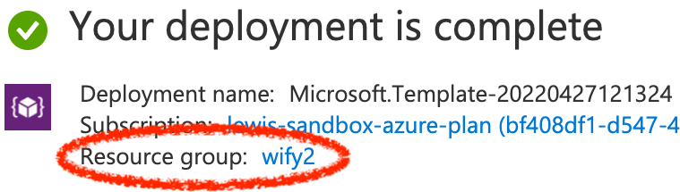

## Deploy Wayfinder on AKS

### Pre-requisites

- Access to an existing [Azure subscription](https://docs.microsoft.com/en-us/azure/guides/developer/azure-developer-guide#understanding-accounts-subscriptions-and-billing)
- If you don't have an Azure subscription, create an [Azure free account](https://azure.microsoft.com/free/?ref=microsoft.com&utm_source=microsoft.com&utm_medium=docs&utm_campaign=visualstudio) before you begin.
- Review the [Wayfinder Free License](https://www.appvia.io/software-license-agreement-free?utm_campaign=Azure%20Marketplace&utm_source=web&utm_medium=Github&utm_term=Appvia%20/%20Wayfinder&utm_content=Licence%20agreement)

### Deploy
This template deploys [Wayfinder](https://www.appvia.io/wayfinder). Wayfinder provides management of cloud Kubernetes. For more information see [Wayfinder Documentation](https://docs.appvia.io/wayfinder).

<a href="https://portal.azure.com/#create/Microsoft.Template/uri/https%3A%2F%2Fraw.githubusercontent.com%2Fappvia%2Fwayfinder-azure%2Fmaster%2Farm-template%2Fazuredeploy.json/createUIDefinitionUri/https%3A%2F%2Fraw.githubusercontent.com%2Fappvia%2Fwayfinder-azure%2Fmaster%2Farm-template%2FcreateUiDefinition.json" rel="nofollow"></a>
<a href="http://armviz.io/#/?load=https%3A%2F%2Fraw.githubusercontent.com%2Fappvia%2Fwayfinder-azure%2Fmaster%2Farm-template%2Fazuredeploy.json" rel="nofollow"></a></p>

### Validating Template changes

If making changes to the ARM templates, run the test suite in the ARM Template Testing Toolkit to make sure the templates are valid and unlikely to have issues when being submitted to the Marketplace. See [here]() for more details on the toolkit tests, but to run the tests you will need to have PowerShell installed, and the toolkit downloaded so the relevant modules can be imported into PowerShell:

#### Download Powershell

On MacOS, the simplest way is to install via `brew`:

```shell
$ brew install --cask powershell
```

And from here, `pwsh` will fork a new PowerShell process. Rejoice!

>For other platforms, see [here](https://docs.microsoft.com/en-us/powershell/scripting/install/installing-powershell?view=powershell-7.2).


#### Download the testing toolkit

The ARM Template Testing Toolkit (ttk) can be downloaded [here](https://aka.ms/arm-ttk-latest). Just download the zip, and unzip somewhere sensible.

More information about the toolkit can be found at https://docs.microsoft.com/en-us/azure/azure-resource-manager/templates/test-toolkit

#### Run the tests

Running the tests is straightforward. Ensure you are in the PowerShell (`pwsh` from Bash and friends), and in the `wayfinder-azure/arm-template` directory, then:

```powershell
# The following imports the testing module into PowerShell
PS /Path/To/wayfinder-azure/arm-tamplate> Import-Module </Path/To/testing/toolkit>/arm-ttk/arm-ttk.psd1
# The following runs the testing toolkit tests
PS /Path/To/wayfinder-azure/arm-tamplate> Test-AzTemplate -TemplatePath .
```

### Post Install Steps

After installation you must follow these steps to logon and set a password:

1. [Download the Wayfinder cli](https://docs.appvia.io/wayfinder/cli)
1. Obtain the commands and password from the deployment Outputs in the console:
    

1. Run the post install commands, as obtained, from the outputs.
1. See [Wayfinder Documentation](https://docs.appvia.io/wayfinder).

### Delete Installation

To delete the install of Wayfinder and the AKS cluster, simply delete the resource group used by the deployment above:

1. Identify the resource group you specified in the deployment e.g.
    

1. [Delete the resource group](https://docs.microsoft.com/en-us/azure/azure-resource-manager/management/manage-resource-groups-portal#delete-resource-groups)
