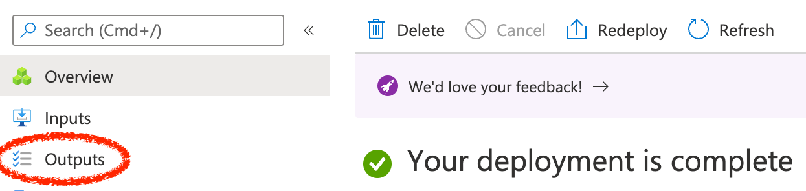

Warning Under Development - Coming soon!

### Deploy Wayfinder on AKS

#### Pre-requisites

- Access to an existing [Azure subscription](https://docs.microsoft.com/en-us/azure/guides/developer/azure-developer-guide#understanding-accounts-subscriptions-and-billing)
- If you don't have an Azure subscription, create an [Azure free account](https://azure.microsoft.com/free/?ref=microsoft.com&utm_source=microsoft.com&utm_medium=docs&utm_campaign=visualstudio) before you begin.
- Review the [Wayfinder Free License](https://www.appvia.io/software-license-agreement-free?utm_campaign=Azure%20Marketplace&utm_source=web&utm_medium=Github&utm_term=Appvia%20/%20Wayfinder&utm_content=Licence%20agreement)

#### Deploy
This template deploys [Wayfinder](https://www.appvia.io/wayfinder). Wayfinder provides management of cloud Kubernetes. For more information see [Wayfinder Documentation](https://docs.appvia.io/wayfinder).

#### Post Install Steps

After installation you must follow these steps to logon and set a password:

1. [Download the Wayfinder cli](https://docs.appvia.io/wayfinder/cli)
1. Obtain the commands and password from the deployment Outputs in the console:
    

1. Run the post install commands, as obtained, from the outputs.
1. See [Wayfinder Documentation](https://docs.appvia.io/wayfinder).
